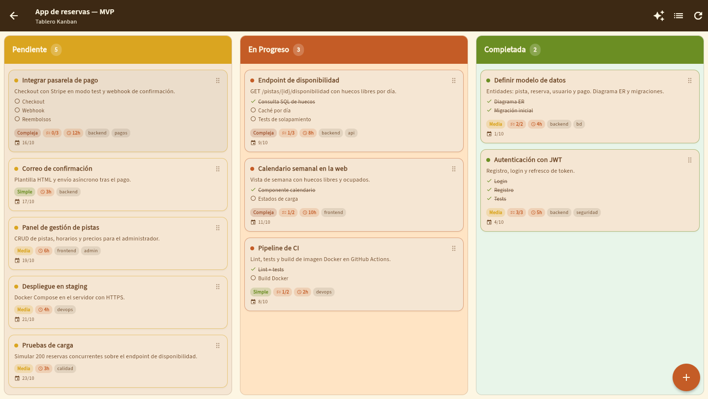
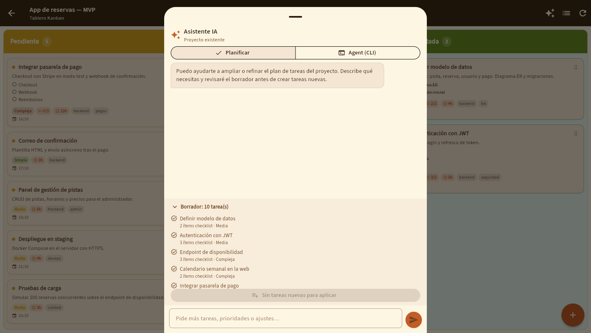
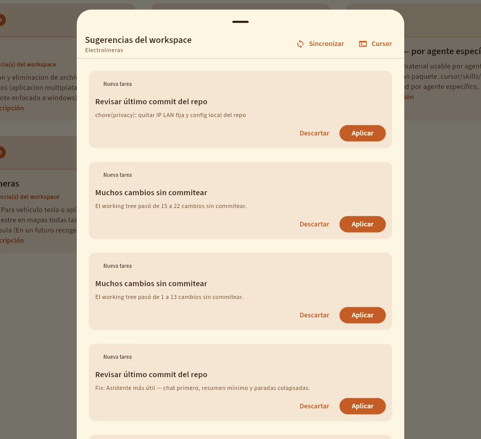
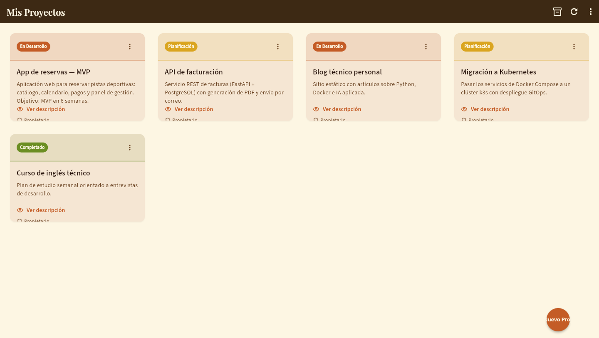
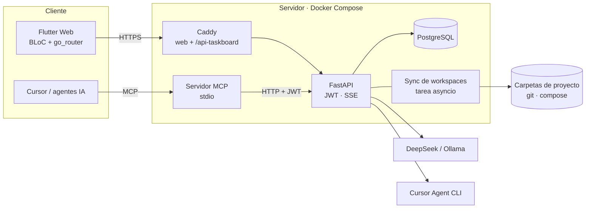

# TaskBoard — gestor de proyectos con asistente IA y servidor MCP


[](LICENSE)

**En uso en producción: <https://kanban.jualas.es>** (requiere cuenta).

Gestor de proyectos y tareas (Kanban y lista) con un **asistente IA que planifica el backlog**, proyectos **vinculados a su carpeta de código** y un **servidor MCP** para que agentes de IA como Cursor consulten y actualicen las tareas. Es la herramienta con la que planifico y sigo todos mis proyectos.



| Asistente IA del proyecto (planificar / agente) | Sugerencias automáticas desde los cambios del repo |
|---|---|
|  |  |

<details><summary>Lista de proyectos</summary>



</details>

*Capturas con datos de demostración, salvo las sugerencias, que son de producción.*

## De TFG a producto

TaskBoard nació como mi **proyecto de fin de ciclo de DAM en el CIFP Carlos III de Cartagena**: un sistema de seguimiento de TFG para alumnos, tutores y centro, hecho con Flutter + Supabase ([proyecto_flutter_supabase](https://github.com/jualas/proyecto_flutter_supabase)).

Después lo convertí en una herramienta propia y lo rehíce por dentro:

| | TFG (2025) | TaskBoard (2026) |
|---|---|---|
| Backend | Supabase (BaaS) | **API propia FastAPI + PostgreSQL** (asyncpg, SQL a mano) |
| Autenticación | Supabase Auth | JWT propio (python-jose + bcrypt) |
| IA | — | Chat de backlog, tareas desde un brief, agente Cursor CLI |
| Integración | — | Servidor **MCP** y export de `TASKBOARD.md` a cada repo |
| Despliegue | Supabase cloud | Docker Compose autoalojado + Caddy + Cloudflare Tunnel |

Quitar Supabase fue una decisión de aprendizaje: diseñar yo el esquema, la autenticación y la API en lugar de delegarlos en un BaaS.

## Qué hace

- **Proyectos y tareas** en Kanban (arrastrar entre columnas) o en lista, con complejidad, horas estimadas, fecha límite, etiquetas y subtareas.
- **Asistente IA del proyecto**
  - *Planificar*: chat en streaming (SSE) que propone tareas y las crea con un clic.
  - *Sugerir con IA*: rellena una tarea a partir de un brief.
  - *Agente*: ejecuta **Cursor Agent CLI** sobre la carpeta del proyecto.
  - Motores intercambiables: Cursor Agent → DeepSeek → Ollama (API compatible con OpenAI).
- **Workspaces**: cada proyecto puede vincularse a su carpeta (repo git, stack Docker). La API toma *snapshots* periódicos, detecta cambios y propone tareas; también exporta `TASKBOARD.md` al repo.
- **Servidor MCP** ([`mcp-taskboard/`](mcp-taskboard/)): 14 herramientas para que un agente liste proyectos, cree tareas, cambie estados o lea el estado del workspace.
- **«Abrir en Cursor»**: enlace Remote SSH directo a la carpeta del proyecto en el servidor.

## Arquitectura



## Stack

| Capa | Tecnología |
|---|---|
| API | Python 3.12, **FastAPI**, Pydantic v2, **asyncpg** (SQL sin ORM), python-jose (JWT), passlib/bcrypt, httpx |
| Base de datos | **PostgreSQL 16**, migraciones SQL versionadas (`backend/migrations/`) |
| Cliente | **Flutter Web** (Dart 3), flutter_bloc, go_router, json_serializable |
| IA | DeepSeek y Ollama (API compatible con OpenAI), Cursor Agent CLI, streaming SSE |
| Integración | **MCP** (Model Context Protocol, SDK Python) |
| Infraestructura | Docker Compose, Caddy, Cloudflare Tunnel |

## Arrancar en local

Requisitos: Docker con Compose.

```bash
cp .env.example .env
# Edita .env: JWT_SECRET (openssl rand -base64 48) y, si quieres IA, DEEPSEEK_API_KEY

# Compilar la web (con la imagen oficial de Flutter, sin instalar nada)
docker run --rm -v "$PWD/frontend":/app -w /app ghcr.io/cirruslabs/flutter:stable \
  bash -lc "flutter pub get && flutter build web --release"

docker compose up -d --build
```

- Web: <http://localhost:8580> (crea una cuenta desde la pantalla de login).
- API y documentación OpenAPI: <http://localhost:8101/docs>.

Las migraciones se aplican solas al crear la base de datos. La vinculación de carpetas y el agente Cursor vienen desactivados en este modo; ver [`backend/.env.example`](backend/.env.example).

**Servidor MCP para Cursor:** `./scripts/install-cursor-mcp-taskboard.sh` (detalles en [`docs/MCP_TASKBOARD.md`](docs/MCP_TASKBOARD.md)).

## Estructura

```
backend/          API FastAPI (routers, workspace, agente IA) y migraciones SQL
frontend/         Cliente Flutter (lib/blocs, screens, services, widgets)
mcp-taskboard/    Servidor MCP (stdio) sobre la API
scripts/          Instalación del MCP, export de TASKBOARD.md
deploy/           Caddyfile
docs/             Asistente IA, MCP, Ollama remoto, conexión desde portátil
```

## Documentación

- [`MANUAL_USUARIO.md`](MANUAL_USUARIO.md): uso de la app y del asistente IA.
- [`docs/IA_ASISTENTE.md`](docs/IA_ASISTENTE.md): motores de IA y flujo de planificación.
- [`docs/MCP_TASKBOARD.md`](docs/MCP_TASKBOARD.md): servidor MCP y herramientas.
- [`docs/INFORME_OLLAMA_REMOTO_TASKBOARD.md`](docs/INFORME_OLLAMA_REMOTO_TASKBOARD.md): Ollama en otra máquina de la red.
- [`docs/INFORME_CONEXION_CURSOR_PORTATIL_TASKBOARD.md`](docs/INFORME_CONEXION_CURSOR_PORTATIL_TASKBOARD.md): trabajar desde un portátil por SSH.
- [`INSTRUCCIONES_AGENTE.md`](INSTRUCCIONES_AGENTE.md): despliegue en el servidor de producción.

## Autor

**jualas** (Juan Antonio Francés Pérez) · [LinkedIn](https://www.linkedin.com/in/jualas/) · [GitHub](https://github.com/jualas)

Licencia [MIT](LICENSE).
