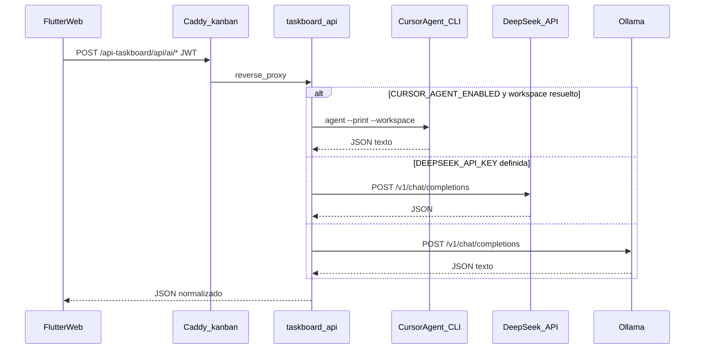

# Asistente IA para tareas (TaskBoard)

Documentación de la funcionalidad que ayuda a **redactar, planificar y alinear tareas** con el código del proyecto, usando la **API TaskBoard (FastAPI)** como único backend de IA.

## 1) Qué hace el usuario

### Sugerir una tarea (formulario)

1. En **Nueva tarea** (Kanban o lista), pulsa **Sugerir con IA**.
2. Escribe un **brief** (objetivo, alcance, restricciones).
3. La app llama a `POST /api/ai/suggest`; si la respuesta es correcta, se **rellenan** título, descripción, complejidad, horas estimadas, etiquetas y checklist.
4. Revisa y edita antes de **Crear**.

### Asistente del proyecto (Kanban / lista)

1. Abre un proyecto → icono **Asistente IA del proyecto** (barra superior).
2. Modo **Planificar**: conversación para refinar el backlog; puede incluir contexto git/docker si el proyecto tiene **carpeta workspace** vinculada.
3. Modo **Agent (CLI)**: ejecuta el CLI **`agent`** de Cursor en la carpeta workspace (streaming en la UI). Requiere workspace vinculado y `CURSOR_AGENT_ENABLED=true` en el API.
4. Aplica los cambios al tablero con el botón correspondiente cuando el borrador te convenga.

La IA **propone**; la decisión final es siempre del usuario.

## 2) Arquitectura (resumen)

La app Flutter **solo** habla con la **API TaskBoard** (JWT). No hay Supabase ni Edge Functions en el flujo actual.



**Prioridad del motor IA** (en `backend/app/routers/ai.py`, función `_invoke_llm`):

1. **Cursor Agent CLI** — si `CURSOR_AGENT_ENABLED=true` y hay carpeta workspace resuelta (la del proyecto, o `CURSOR_AGENT_DEFAULT_WORKSPACE` en sugerencias sin proyecto).
2. **DeepSeek (nube)** — si `DEEPSEEK_API_KEY` tiene valor.
3. **Ollama** — si DeepSeek no está configurado (`OLLAMA_BASE_URL`, `LOCAL_LLM_MODEL`).

El campo `provider` en la respuesta indica cuál se usó: `cursor_agent`, `deepseek` o `local`.

## 3) Componentes en el código

| Capa | Ubicación | Rol |
|------|-----------|-----|
| UI tarea | [`frontend/lib/screens/forms/task_form.dart`](../frontend/lib/screens/forms/task_form.dart) | Botón *Sugerir con IA*, diálogo de brief |
| UI proyecto | [`frontend/lib/widgets/project_ai_chat_panel.dart`](../frontend/lib/widgets/project_ai_chat_panel.dart) | Chat *Planificar* / *Agent (CLI)* |
| Cliente | [`frontend/lib/services/ai_assistant_service.dart`](../frontend/lib/services/ai_assistant_service.dart) | `POST /api/ai/suggest`, `/api/ai/chat`, SSE `/api/ai/agent-stream` |
| Backend | [`backend/app/routers/ai.py`](../backend/app/routers/ai.py) | Prompts, elección de proveedor, parseo JSON |
| Cursor CLI | [`backend/app/cursor_agent.py`](../backend/app/cursor_agent.py) | Invocación headless de `agent --print` |
| Sesiones agent | [`backend/app/agent_sessions.py`](../backend/app/agent_sessions.py) | Reanudar sesión por proyecto, historial de runs |
| Workspace | [`backend/app/workspace.py`](../backend/app/workspace.py) | Snapshot git/docker para contexto en chat |

### Endpoints IA

| Método | Ruta | Uso |
|--------|------|-----|
| `POST` | `/api/ai/suggest` | Una tarea (`userMessage`) o plan inicial (`projectPlan: true`) |
| `POST` | `/api/ai/chat` | Conversación de backlog; opcional `projectId` para contexto workspace |
| `POST` | `/api/ai/agent-stream` | SSE del CLI Cursor Agent (solo con workspace vinculado) |
| `GET` | `/api/projects/{id}/agent-session` | Sesión agent persistida |
| `DELETE` | `/api/projects/{id}/agent-session` | Reiniciar sesión |
| `GET` | `/api/projects/{id}/agent-runs` | Historial de prompts agent |

Todas las rutas requieren **`Authorization: Bearer <JWT>`** (misma sesión que el login web).

### Contrato de entrada (suggest)

```json
{
  "userMessage": "texto del usuario",
  "projectPlan": false,
  "projectContext": { "title": "...", "description": "..." }
}
```

Cabecera opcional: `x-operation-id: tb_suggest_v1` (informativa; el API no la interpreta).

### Contrato de salida (suggest, éxito)

```json
{
  "tasks": [
    {
      "title": "...",
      "description": "...",
      "complexity": "simple|medium|complex",
      "estimatedHours": null,
      "tags": [],
      "subtasks": []
    }
  ],
  "provider": "cursor_agent|deepseek|local"
}
```

En el formulario de tarea se usa **la primera entrada** de `tasks`.

### Contrato de salida (chat)

```json
{
  "message": "texto en español",
  "tasks": null,
  "provider": "..."
}
```

Si `tasks` es una lista, sustituye el borrador del panel de chat.

## 4) Privacidad y seguridad

- Claves (`DEEPSEEK_API_KEY`, `CURSOR_API_KEY`, `JWT_SECRET`) **solo** en el `.env` del contenedor `taskboard-api` (`/mnt/datos/docker/taskboard-api/.env`); nunca en el build Flutter ni en el repo.
- Con **DeepSeek**, el texto sale hacia **api.deepseek.com**; revisa su política si el contenido es sensible.
- Con **Ollama**, el texto no sale del entorno acordado (mini PC local o servidor Ollama remoto en LAN).
- Con **Cursor Agent**, el CLI accede al **filesystem del workspace** montado en el contenedor API; limita `WORKSPACE_ROOTS` y permisos de montaje.

## 5) Infraestructura y operación

### Despliegue en producción

| Componente | Ruta / URL |
|------------|------------|
| API + Postgres | `/mnt/datos/docker/taskboard-api/` |
| Web (Caddy) | `/mnt/datos/docker/taskboard-web/` → `https://kanban.jualas.es` |
| Proxy mismo origen | Caddy: `/api-taskboard/*` → `taskboard-api:8000` |
| Config Flutter | `frontend/assets/data/config.json` → `taskboardApi.useSameOriginProxy: true`, `proxyPrefix: "/api-taskboard"` |

Plantilla de variables IA: [`backend/.env.example`](../backend/.env.example).

Tras editar `.env`:

```bash
cd /mnt/datos/docker/taskboard-api
docker compose up -d
```

Caddy tiene **read_timeout / write_timeout de 1200 s** para peticiones IA largas (plan de proyecto, Cursor Agent).

### DeepSeek (recomendado si no quieres cargar CPU local)

1. Obtén API key en [DeepSeek Platform](https://platform.deepseek.com/).
2. En `/mnt/datos/docker/taskboard-api/.env`:

   ```env
   DEEPSEEK_API_KEY=sk-...
   DEEPSEEK_MODEL=deepseek-chat
   ```

3. Reinicia el contenedor API.
4. Comprueba que la clave llegó (sin mostrar valor):

   ```bash
   docker exec taskboard-api sh -c 'test -n "$DEEPSEEK_API_KEY" && echo CLAVE_PRESENTE || echo CLAVE_FALTA'
   ```

Si `DEEPSEEK_API_KEY` tiene valor, el backend **no** usa Ollama salvo fallback explícito tras fallo de Cursor Agent (`CURSOR_AGENT_FALLBACK_LLM=true`).

### Ollama (local o remoto)

- **Local en mini PC:** `OLLAMA_BASE_URL=http://host.docker.internal:11434` (con `extra_hosts: host-gateway` en compose).
- **Remoto en LAN:** ver [`INFORME_OLLAMA_REMOTO_TASKBOARD.md`](INFORME_OLLAMA_REMOTO_TASKBOARD.md).

Variables clave:

```env
DEEPSEEK_API_KEY=
OLLAMA_BASE_URL=http://<IP_OLLAMA>:11434
LOCAL_LLM_MODEL=qwen2.5:3b-instruct-q4_K_M
OLLAMA_TIMEOUT_SEC=180
OLLAMA_TIMEOUT_PLAN_SEC=600
```

### Cursor Agent CLI (mini PC, recomendado en producción)

Requiere el comando **`agent`** instalado y autenticado en el host (o `CURSOR_API_KEY` en `.env`).

```env
CURSOR_AGENT_ENABLED=true
CURSOR_AGENT_BIN=agent
CURSOR_AGENT_HOME=/home/jualas
CURSOR_AGENT_DEFAULT_WORKSPACE=/mnt/datos/.../taskboard
CURSOR_AGENT_MODE=ask
CURSOR_AGENT_TIMEOUT_SEC=180
CURSOR_AGENT_TIMEOUT_PLAN_SEC=600
CURSOR_AGENT_FALLBACK_LLM=false
```

El contenedor `taskboard-api` debe montar el binario `agent`, el home de Cursor y las raíces de workspace (`WORKSPACE_ROOTS`) en **lectura/escritura** donde aplique.

Documentación operativa del puente manual: [`docs/MCP_TASKBOARD.md`](MCP_TASKBOARD.md) § Script puente.

## 6) Limitaciones conocidas

- **Latencia:** primera respuesta con Ollama en CPU puede tardar **varios decenas de segundos**; Cursor Agent en repos grandes puede superar **varios minutos** (Caddy y cliente Flutter tienen timeouts amplios).
- **Calidad:** depende del modelo, brief y contexto workspace; revisar siempre antes de guardar.
- **Sin proveedor operativo:** si Cursor Agent falla y no hay fallback, y tampoco DeepSeek ni Ollama, la petición devuelve **502**.
- **Agent (CLI) sin workspace:** `POST /api/ai/agent-stream` responde **400** si el proyecto no tiene carpeta workspace vinculada.

### 6.1) `Failed to fetch` / errores de red

Causas habituales:

1. **API no accesible** — comprobar contenedores `taskboard-api` y `taskboard-web`.
2. **CORS** — en web de producción debe usarse **mismo origen** (`useSameOriginProxy: true`); no hace falta CORS cross-origin si kanban y API van por `https://kanban.jualas.es/api-taskboard/`.
3. **Timeout del proxy** — peticiones IA muy largas; Caddy ya usa 1200 s; si hay otro proxy delante (Cloudflare), revisar límites allí.
4. **Modo local sin API** — si `config.json` no define `taskboardApi`, la app usa almacenamiento local y la IA queda **deshabilitada**.

### 6.2) Error 502 del proveedor IA

| Síntoma | Causa probable |
|---------|----------------|
| `Cursor Agent CLI: ...` | CLI no instalado, sin auth, workspace no montado |
| `DeepSeek (402)` | Saldo insuficiente en cuenta DeepSeek |
| `No se pudo conectar con Ollama` | Ollama parado, IP incorrecta o firewall |
| JSON vacío / parse error | Modelo devolvió texto no JSON; reintentar o cambiar proveedor |

Logs:

```bash
docker logs taskboard-api 2>&1 | tail -80
```

### 6.3) El formulario no se rellena

- Respuesta con `tasks: []` — el modelo no generó entradas válidas; acorta el brief o cambia proveedor.
- Parseo en Flutter normaliza mapas con `Map<String, dynamic>.from(...)` (no descarta entradas por tipo genérico).

## 7) Prueba rápida (operador)

### Ollama directo (host donde corre Ollama)

```bash
curl -sS http://127.0.0.1:11434/v1/chat/completions \
  -H "Content-Type: application/json" \
  -d '{"model":"qwen2.5:3b-instruct-q4_K_M","messages":[{"role":"user","content":"Responde solo con OK"}],"temperature":0}'
```

### API TaskBoard (sustituir URL y credenciales)

```bash
TOKEN=$(curl -sS -X POST "https://kanban.jualas.es/api-taskboard/auth/login" \
  -H "Content-Type: application/json" \
  -d '{"email":"TU_EMAIL","password":"TU_CLAVE"}' | jq -r .access_token)

curl -sS "https://kanban.jualas.es/api-taskboard/api/ai/suggest" \
  -H "Authorization: Bearer $TOKEN" \
  -H "Content-Type: application/json" \
  -H "x-operation-id: tb_suggest_v1" \
  -d '{"userMessage":"Planificar tarea de login","projectContext":{"title":"Demo"}}'
```

En LAN directa al puerto del API: `http://<IP_MINIPC>:8101/api/ai/suggest`.

## 8) Workspace vinculado al proyecto

Cuando un proyecto tiene **carpeta workspace** (Editar proyecto → *Carpeta workspace*):

1. El API valida la ruta contra **`WORKSPACE_ROOTS`** y puede generar un **snapshot** (git: rama, commit, cambios; docker compose ps si hay compose).
2. El **chat IA** (`POST /api/ai/chat` con **`projectId`**) incluye ese contexto en el system prompt.
3. El **modo Agent** ejecuta el CLI en esa carpeta.
4. Endpoints útiles: `POST /api/projects/workspace-snapshot-preview`, `GET /api/projects/{id}/workspace-snapshot`.

Requisitos: montajes `:rw` en `taskboard-api`, migraciones **`002_workspace_path.sql`**, **`003_workspace_snapshots.sql`**, **`004_agent_sessions.sql`**. Ver `INSTRUCCIONES_AGENTE.md` § Workspace.

## 9) Integración con Cursor IDE (fuera del chat web)

- **MCP TaskBoard:** [`docs/MCP_TASKBOARD.md`](MCP_TASKBOARD.md) — CRUD y workspace desde Cursor.
- **Export TASKBOARD.md:** botón en Kanban, MCP `export_taskboard_md`, script `scripts/export_taskboard_md.py`.
- **Prompt IDE:** menú *Prompt IDE (Cursor)* / `POST /api/projects/{id}/ide-session`.

---

Índice general de documentación: [`README.md`](../README.md).
