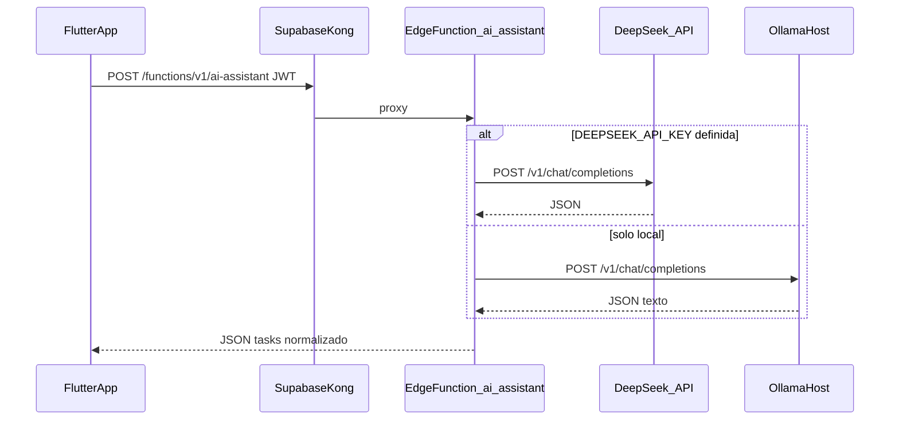

# Asistente IA para tareas (TaskBoard)

Documentación de la funcionalidad que ayuda a **redactar y estructurar tareas** a partir de una descripción en lenguaje natural, alineada con el uso de TaskBoard como **gestor de proyectos** y apoyo a **metodología ágil** (backlog, desglose de trabajo).

## 1) Qué hace el usuario

1. En **Nueva tarea** (Kanban o lista), pulsa **Sugerir con IA**.
2. Escribe un **brief** (qué hay que conseguir, alcance, restricciones).
3. La app llama al backend; si la respuesta es correcta, se **rellenan** título, descripción, complejidad, horas estimadas, etiquetas y checklist (subtareas) en el formulario.
4. El usuario **revisa y edita** antes de **Crear** (la IA es asistencia, no decisión final).

## 2) Arquitectura (resumen)

La app solo llama a **Supabase Edge Functions** con la sesión del usuario (`supabase_flutter`). La función elige el backend:

- **DeepSeek (nube)** si en el stack Supabase existe la variable de entorno **`DEEPSEEK_API_KEY`** (recomendado si no quieres cargar la CPU local).
- **Ollama (local)** si esa clave **no** está definida: el modelo corre en el mini PC.



## 3) Componentes en el código

| Capa | Ubicación | Rol |
|------|-----------|-----|
| UI | [`frontend/lib/screens/forms/task_form.dart`](../frontend/lib/screens/forms/task_form.dart) | Botón *Sugerir con IA*, diálogo de brief, aplicación al formulario |
| Cliente | [`frontend/lib/services/ai_assistant_service.dart`](../frontend/lib/services/ai_assistant_service.dart) | `Supabase.functions.invoke('ai-assistant', body: …)` y parseo de `tasks` |
| Backend | `volumes/functions/ai-assistant/index.ts` en el stack Supabase (ver ruta en §5) | Elige DeepSeek u Ollama; prompt, `response_format` JSON (DeepSeek), parseo y saneado |
| Modelo nube | DeepSeek API | `deepseek-chat` por defecto (`DEEPSEEK_MODEL`) |
| Modelo local | Ollama en el host | `qwen2.5:3b-instruct-q4_K_M` si no hay clave DeepSeek |

Contrato de entrada (cuerpo JSON hacia la función):

- **Operación (Cloudflare)**: **no** uses **`x-taskboard-intent`** ni **`x-tb-op`**: en este dominio Cloudflare **bloquea esas cabeceras en POST** → **502** sin CORS. La app Flutter envía **`x-operation-id: tb_suggest_v1`**. Otros valores: **`tb_brief_v1`**, **`tb_misc_v1`**, **`tb_batch_v1`**, **`tb_plan_v1`**. **No** envíes la clave JSON **`intent`**.
- Operaciones internas tras normalizar: **`agile`**, **`brief`**, **`suggest`**, **`tasks`**, **`task_plan`**.
- `userMessage`: texto del usuario.
- `projectContext`: opcional (`title`, `description`, etc.).

Contrato de salida (éxito):

- `{ "tasks": [ { "title", "description", "complexity", "estimatedHours", "tags", "subtasks" } ] }`

La app usa **la primera tarea** de la lista para rellenar el formulario.

## 4) Privacidad y seguridad

- **Claves de APIs** (`DEEPSEEK_API_KEY`) solo en el **entorno del contenedor** Edge Functions / `.env` del stack Supabase; **nunca** en el build Flutter ni en el repo.
- Con **DeepSeek**, el texto del brief sale del servidor hacia **api.deepseek.com**; revisa la política de privacidad del proveedor si el contenido es sensible.
- Con **Ollama**, el brief no sale del entorno local (Edge Function → host Docker).
- Sigue aplicando **JWT / anon key** en la invocación de funciones (`VERIFY_JWT` según tu stack).

## 5) Infraestructura y operación

### DeepSeek (recomendado para no saturar la CPU)

1. Obtén una API key en [DeepSeek Platform](https://platform.deepseek.com/).
2. En el **`.env` del stack Supabase** (el que acompaña a `docker-compose.yml` de Supabase, **no** el `.env` del frontend Flutter), añade las variables. Plantilla: [`docs/EJEMPLO_ENV_SUPABASE_IA.env`](EJEMPLO_ENV_SUPABASE_IA.env).
   - Ruta típica en este entorno: `/mnt/datos/docker/supabase/.env`
3. **Recrear el servicio** para que el contenedor reciba la variable (un simple `restart` no basta si acabas de añadir la clave al `.env`):
   ```bash
   docker compose --project-directory /mnt/datos/docker/supabase \
     -f /mnt/datos/docker/supabase/docker-compose.yml up -d functions
   ```
4. **Comprobar** que la clave llegó al contenedor (no mostrará el valor):
   ```bash
   docker exec supabase-edge-functions sh -c 'test -n "$DEEPSEEK_API_KEY" && echo CLAVE_PRESENTE || echo CLAVE_FALTA'
   ```
   Si sale `CLAVE_FALTA`, la función seguirá usando **Ollama local**.

Si la app usa **`api-supabase.jualas.es`**, el `.env` a editar es el del **servidor donde corre ese stack**, no solo la máquina de desarrollo.

Si `DEEPSEEK_API_KEY` está definida y no vacía en el contenedor, **no** se usa Ollama para esta función.

Tras generar una sugerencia, el mensaje de la app indica **DeepSeek (nube)** u **Ollama (local)** según el campo `provider` de la respuesta.

### Ollama local

La puesta en marcha de Ollama, `systemd --user`, `host.docker.internal` y `LOCAL_LLM_MODEL` está en [`MANUAL_DESARROLLADOR_SUPABASE.md`](../MANUAL_DESARROLLADOR_SUPABASE.md) (sección **13**).

Rutas habituales:

- Función: `/mnt/datos/docker/supabase/volumes/functions/ai-assistant/`
- Compose: `/mnt/datos/docker/supabase/docker-compose.yml` (servicio `functions`: `DEEPSEEK_*`, `LOCAL_LLM_MODEL`)

## 6) Limitaciones conocidas

- **Latencia en CPU**: la primera respuesta puede tardar **varios decenas de segundos** según carga del equipo y si el modelo está caliente.
- **Calidad**: depende del modelo y del brief; conviene revisar siempre título, estimación y subtareas antes de guardar.
- **Sin DeepSeek y sin Ollama**: la función fallará hasta que exista al menos un backend operativo.

### 6.1) `ClientException: Failed to fetch` (login, proyectos, IA, todo el API)

Si **todo** el dominio `api-supabase.*` deja de responder, revisa que **Kong** haya arrancado: un error en `volumes/api/kong.yml` impide cargar la API entera (`docker logs supabase-kong`). En CORS, el origen comodín debe escribirse **`'*'`** (comillas simples en YAML); `-"*"` con comillas dobles puede romper el parseo y dejar Kong en bucle de error.

En `kong.yml`, **auth**, **rest**, **graphql**, **realtime**, **storage**, **functions-v1**, **mcp** y **dashboard** comparten el mismo bloque CORS anclado (`&cors_browser` / `*cors_browser`): orígenes explícitos (`https://kanban.jualas.es`, localhost) más `'*'`, y cabeceras permitidas (`Authorization`, `apikey`, …). Sin eso, el **preflight** (`OPTIONS`) puede responder sin `Access-Control-Allow-Origin` y el navegador bloquea login e IA. Tras editar: **`docker restart supabase-kong`** (o el nombre del contenedor Kong en tu compose).

Si **OPTIONS** devuelve CORS bien en el host local pero falla en `api-supabase.jualas.es`, revisa el **túnel/proxy** delante (p. ej. Cloudflare): reglas que quiten cabeceras o bloqueen OPTIONS.

**Misma origen (recomendado si el error persiste):** en `config.json`, `useSameOriginProxy: true` y en Nginx del host que sirve el kanban un `location /supabase/` con `proxy_pass` al API real (ver `frontend/docker/nginx/nginx.conf`). La app en web usará `https://kanban…/supabase` como base de Supabase: **no hay petición cross-origin** y los 502 del edge dejan de mostrarse como fallo CORS.

No uses un `httpClient` global tipo `FetchClient` en `Supabase.initialize` salvo que hayas validado auth y REST: puede interferir con el login en web.

### 6.15) Cloudflare WAF: 502 y “parece CORS” solo en Sugerir IA

En algunos despliegues, un **POST** cuyo cuerpo JSON incluye la clave **`intent`** (p. ej. `{"intent":"agile",...}`) no llega a Kong: Cloudflare responde **502** (`error code: 502`) **sin** `via: kong` ni cabeceras CORS → en la app aparece *Failed to fetch* / mensaje de CORS.

**Solución en código (actual):** el cliente Flutter envía **`x-operation-id: tb_suggest_v1`**. En `kong.yml`, CORS debe incluir **`x-operation-id`**. En **web**, `supabase-dart` añade también **`x-supabase-client-platform`** y **`x-supabase-client-platform-version`**; si no están en la lista de cabeceras permitidas del plugin CORS, el **preflight falla** y Chrome muestra *No 'Access-Control-Allow-Origin' header* aunque el `OPTIONS` devuelva 200. Tras editar Kong, **`docker restart supabase-kong`**. **`x-taskboard-intent`** y **`x-tb-op`** pueden estar bloqueadas por Cloudflare en POST aunque Kong las permita.

Si el **502** lleva **`via: kong`** y cuerpo JSON del propio `ai-assistant`, suele ser **fallo del modelo** (DeepSeek/Ollama), no el WAF.

### 6.2) El equipo trabaja pero el formulario no se rellena

Causas corregidas en código:

1. **`max_tokens` demasiado bajo** en la Edge Function (antes 160): el modelo **cortaba el JSON** a mitad; el parse fallaba y se devolvía `tasks: []`. La app no tenía nada que aplicar. Solución: **`max_tokens` ~1024** en `ai-assistant/index.ts` y reinicio del contenedor `supabase-edge-functions`.
2. **Parseo en Flutter**: si `tasks` llegaba como lista de mapas genéricos, `whereType<Map<String,dynamic>>()` **descartaba todos** los ítems. Solución: normalizar con `Map<String, dynamic>.from(...)`.
3. **Markdown** alrededor del JSON (bloques tipo \`\`\`json): la función ahora **retira fences** antes de parsear.

## 7) Prueba rápida (operador)

Desde el host donde corre Ollama (ajustar modelo si cambió):

```bash
curl -sS http://127.0.0.1:11434/v1/chat/completions \
  -H "Content-Type: application/json" \
  -d '{"model":"qwen2.5:3b-instruct-q4_K_M","messages":[{"role":"user","content":"Responde solo con OK"}],"temperature":0}'
```

Prueba vía API pública Supabase (sustituir URL y anon key):

```bash
curl -sS "$SUPABASE_URL/functions/v1/ai-assistant" \
  -H "apikey: $SUPABASE_ANON_KEY" \
  -H "Authorization: Bearer $SUPABASE_ANON_KEY" \
  -H "Content-Type: application/json" \
  -H "x-operation-id: tb_suggest_v1" \
  -d '{"userMessage":"Planificar tarea de login","projectContext":{"title":"Demo"}}'
```

## 8) Evolución futura (ideas)

- Pasar al formulario el **título y descripción reales del proyecto** (hoy el brief usa contexto mínimo en algunos flujos).
- Modo `brainstorm` para ideas de proyecto sin crear tarea aún.
- Cola o job asíncrono si se prioriza UX frente a latencia.

---

Índice general de documentación: [`README.md`](../README.md).
